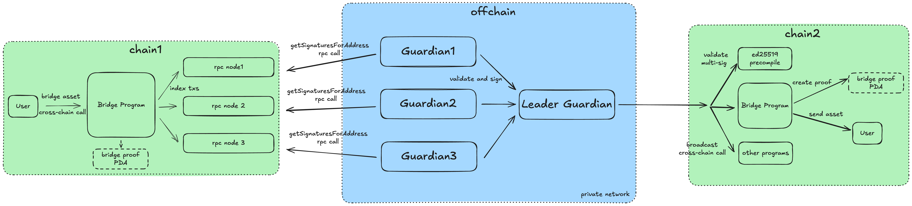

## sBridge Architecture Overview

The architecture includes three core layers: source chain (initiating chain), off-chain guardian network (validation layer), and destination chain (execution layer).

A user initiates a bridge operation—either asset transfer or cross-chain execution—on chain1 by interacting with the Bridge Program, which generates a deterministic PDA as a cryptographic proof of intent. This transaction is indexed by multiple RPC providers and consumed by a decentralized guardian network.

Each guardian independently fetches transactions from rpc, verifies them and signs a canonical hash (covering chain, sender, recipient, mint, amount, nonce, and source tx ID). Once the quorum threshold is reached, the leader guardian aggregates signatures and relays them to chain2. There, the Bridge Program uses Solana’s ed25519 precompile to verify the multi-sig, enforces replay protection via the bridge proof PDA, and then dispatches the token. For cross-chain call, leader guardian would simply decode and broadcast the transaction on chain2.

### Core Layers:

- **On-chain Program Layer**: Handles transaction initiation, asset locking, and bridge proof (PDA) generation.
- **Off-chain Guardian Network**: Decentralized validators independently verify transactions, aggregate signatures, and forward proofs.
- **Destination Chain Execution**: Verifies proofs, executes transactions, and manages asset unlocking or minting.
