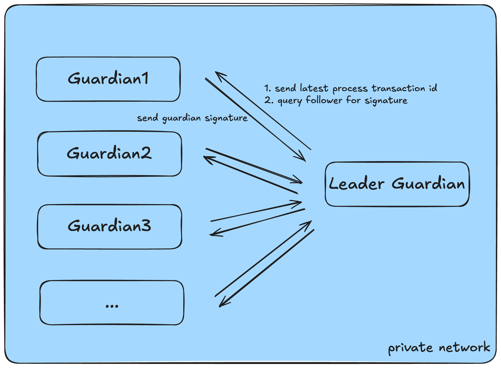

The sBridge off-chain guardian network functions as the verification layer for all cross-chain bridge activities. Guardians independently fetch source chain transactions from different sources, validate and produce cryptographic attestations, and coordinate to reach a threshold multi-sigature that authorizes execution on the destination chain. This layer is designed for decentralization, fault tolerance, and deterministic correctness, ensuring trust-minimized interoperability.

### Leader and Follower Network Model

The sBridge guardian network adopts a **Leader–Follower network model** to efficiently coordinate signature aggregation and relaying under partial synchrony.

All guardians gossip with each other through a private channel, configured through internal DERP (Designated Encrypted Relay for Packets) server. Each guardian operates independently to fetch, validate, and attest transactions from the source chain. Upon successful validation, guardians generate and locally sign a canonical hash of the transaction payload. This cryptographic attestation represents the guardian's commitment to the transaction's correctness.

To streamline multi-signature coordination, a single leader guardian is deterministically selected at the beginning and rotates after processing **N** transactions, based on a round-robin rotation. The leader is responsible for collecting individual guardian signatures until a pre-configured threshold (e.g., t of n) is met. If the leader waits for follower signatures over a certain time threshold, it would reach out to the followers and ask for signatures. Once quorum is reached, the leader constructs the aggregated multi-signature payload and submit to the destination chain.

Follower Guardians do not coordinate directly with each other but continuously gossip their signed attestations to the leader and optional fallback peers. This gossip model enables redundancy in the face of leader failure and supports rapid recovery.

After successfully aggregating and relaying a batch of transactions, the leader guardian broadcasts a commit acknowledgment to all guardians, instructing them to persist the latest processed transaction signature as their local high-water mark. This ensures consistent fault recovery checkpoints across the network and enables seamless leader rotation, allowing any follower to deterministically resume leadership without reprocessing already-committed transactions.

### Transaction Subscription

Each guardian operates against a dedicated RPC endpoint and is responsible for continuously polling new transactions of the bridge program on the source chain.

For both Solana and Solayer chain, each guardian periodically invokes the **getSignaturesForAddress** RPC method on the bridge program ID, starting from the most recently processed transaction signature. This position is stored locally in a durable file. Upon retrieval, signatures are fetched in reverse chronological order and then resolved to full transactions using **getTransaction**. This polling mechanism also works well during guardian crash or new guardian catch up cases as long as the local file is stored properly.

To ensure exactly-once semantics, guardians maintain a local de-duplication set in memory and persistently store the highest processed transaction signature. This eliminates reprocessing due to retries, even in cases of partial crashes or concurrent recovery.

### Multi-Sig Aggregation

After validating a transaction, each guardian generates a deterministic hash over the bridge payload:

**BridgeAsset:** H = hash(sender, recipient, mint, amount, nonce, sourceTxId)

**CrossChainCall:** H = hash(sender, calldata, nonce, sourceTxId)

Each guardian signs this hash using a Hardware Security Module (HSM), which ensures the private key never enters system memory. The designated leader guardian is responsible for collecting signatures until the threshold \( t \) out of \( n \) is reached (e.g., t = 5, n = 7). Once quorum is reached, the leader packages the multi-signature data into a canonical payload and submits it to the destination chain.

The multi-signature scheme supports both static validator sets and dynamic reconfiguration, with guardian public keys stored on-chain and verified using Solana’s `ed25519_program`.

### Failure Recovery

- **Failure Retry**: Bridge execution failures (e.g., transient networking failures) are handled via a fault-tolerant redrive mechanism. Lead guardian continuously scans the cached transaction sessions and process each session based on it's current status. Each retry operation verifies that the transaction has not already been executed on-chain by checking the existence of its PDA proof. This ensures at-least-once delivery semantics without compromising determinism or duplicity protection from the off-chain module perspective.
- **Guardian Leader Failover**: Leader failure (e.g., network partition, crash) is mitigated through a rotating leader election strategy. Guardians periodically exchange heartbeats, and if the current leader becomes unresponsive beyond a timeout window, a new leader is elected deterministically (e.g., round-robin by guardian ID). Any follower should be able to quickly rotate as the new leader as they should have up-to-date fault recovery checkpoint locally stored. During transaction processing, leader leader would broadcast highest processed transaction signature to followers after finishing a batch. Even if the checkpoint transaction is slightly delayed from the actual one, the new leader can still quickly catch up as it would check bridge proof PDA on destination chain for each transaction and quickly identifies already committed ones.
